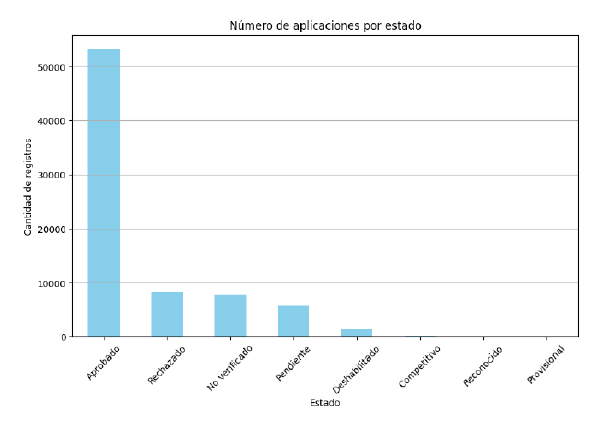

<h1 style="color: red;text-decoration: none;">Spam detection  in application submission v4</h1>

Within the video game industry, a suite of services has emerged that facilitate the acquisition of data via APIs. To support this, development portals are provided by companies, offering a shared space where external developers can access and leverage these platforms. A prime example of this is Riot Games and its platform, [developer.riotgames](https://developer.riotgames.com/), which grants users access to data from all their games through custom-built applications.

However, recent years have highlighted a pressing need for automation in the application creation process to mitigate the platform's misuse, namely, the unrestricted proliferation of applications. Such practices have a detrimental impact on the user experience of both players and developers alike.

This project proposes an automated workflow that involves analyzing the log data associated with each application. By scrutinizing this information, we aim to discriminate between legitimate applications and spam, thereby focusing our efforts on a refined analysis.

## Dataset

Within data processing, we will work with real application data with the following statuses: approved, rejected, unverified, pending, disabled, competitive, recognized, and provisional.

*Number of applications by status*

## Implementation

First, the dataset is loaded from a CSV file. The file path is specified, and the dataset is read using pandas.read_csv with a specified delimiter (;). Any rows with missing values in the 'description' column are dropped.

[Learn more...](./train.md)

## Train Step

BERT (Bidirectional Encoder Representations from Transformers) is a powerful model for natural language processing tasks, known for its ability to understand the context of words in a sentence. 

BERT with an MLP (Multi-Layer Perceptron), we can enhance its feature extraction capabilities. This combination leverages the strengths of both models, leading to more effective and task-specific feature representations. The MLP introduces non-linear transformations and can adapt the general features extracted by BERT to better suit specific tasks, often resulting in improved performance.

[Learn more...](./train_step2.md)

## Results

The performance of the model is reasonably well but may benefit from futher tuning or additional data to improve its performance.

[Learn more...](./results.md)

## Repository

[Code implementation](https://github.com/f3ar161/practicePython/blob/main/BertMLP/gp_v4.ipynb)

<link rel="stylesheet" type="text/css" href="./styles.css">