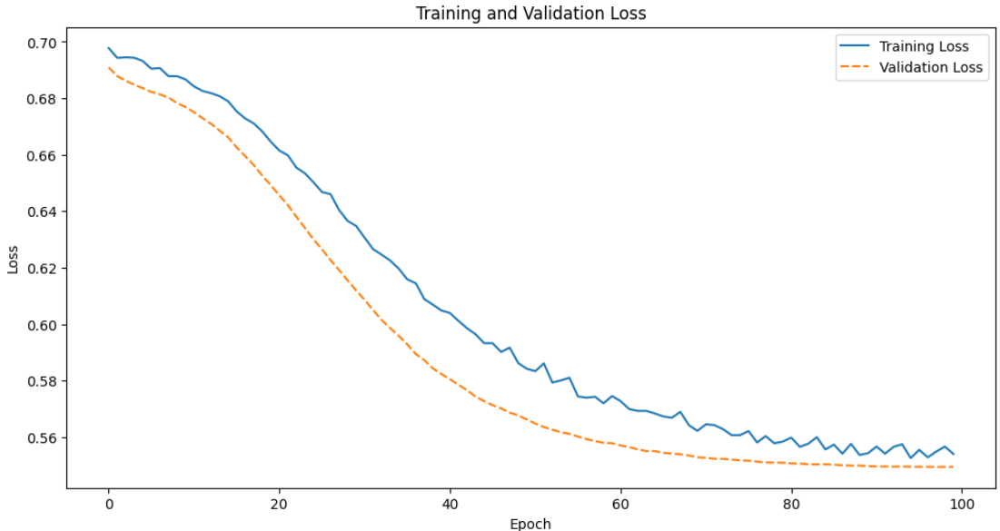
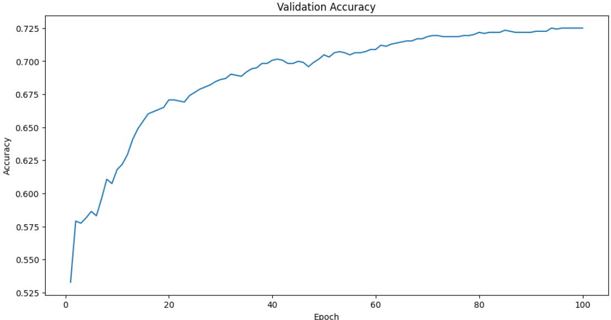
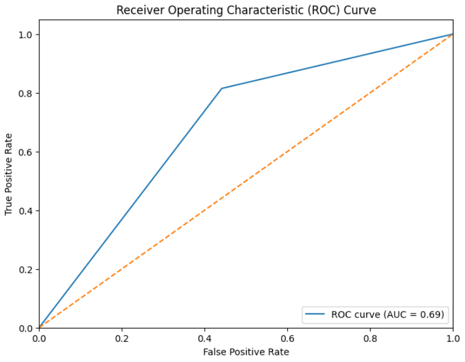

## Results

Accuracy: This metric indicates that approximately 69.42% of the predictions made by the model were correct. While this is a decent accuracy, it suggests there is room for improvement.

F1 Score: The F1 Score of 0.7384 suggests a good balance between precision and recall. This is particularly useful in cases where you need to balance false positives and false negatives.

ROC AUC: The ROC AUC score of 0.6867 indicates that the model has a fair ability to distinguish between the positive and negative classes. A score closer to 1 would indicate a better performance.

- Accuracy: 0.6942 
- F1 Score: 0.7384 
- ROC AUC: 0.6867

*Train and validation loss*

*Validation accuracy*

ROC: The AUC of 0.69 suggests that the model is moderately effective in distinguishing between positive and negative instances.

*ROC curve*

<link rel="stylesheet" type="text/css" href="./styles.css">