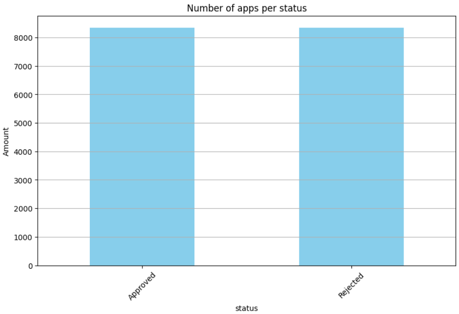
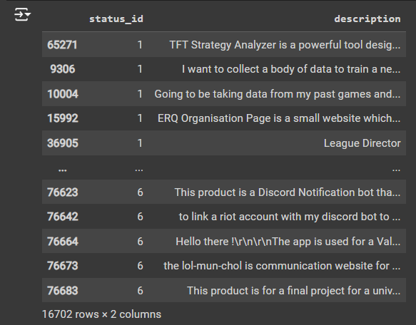

## Implementation

The first part of the implementation is divided into: 

- Load the Dataset  
- Identify Classes
- Balance the Dataset
- Extend and Save


The dataset is divided into two subsets: one containing samples with a status_id of 6 (rejected samples) and another with a status_id of 1 (approved samples). The number of records in each subset is printed.


*Approved and Rejected apps*

We can also check the ds information: 


*Dataset representation*

To balance the dataset, a random sample of approved records is taken, with the sample size equal to the number of rejected records. This ensures that the number of approved and rejected records is the same.


To ensure that the text data is clean, consistent, and ready for further analysis we follow the next steps: 

- Helper Functions: Defines functions to check if a string is a UUID, contains URLs, or contains only numbers.
- Filtering Function: should_filter function filters out descriptions that are too short, contain UUIDs, URLs, or only numbers.
- Lemmatization Function:
  - Filter Descriptions: Skips descriptions that meet the filter criteria.
  - Language Detection: Detects the language of the description and processes only English text.
  - Tokenization: Splits the description into tokens (words).
  - Lemmatization: Converts each token to its base form.
  - Reconstruction: Joins the lemmatized tokens back into a single string.
  
- Application: Applies the lemmatize function to the description column of the dataset.


```
original: 

Product Features
TFT Strategy Analyzer serves the following key functions to support my personal research endeavors:

Statistical Analysis: It offers in-depth statistical analysis of TFT game data, enabling me to gain insights into gameplay patterns and strategic trends. This feature
```

```
result: 

product feature tft strategy analyzer serf the following key function to support my personal research endeavor : statistical analysis : it offer in-depth statistical analysis of tft game data ,
```

The we prepare the data for the bert model: 

Preparing text data in a format suitable for BERT, which requires specific input formats (input IDs and attention masks).

Tokenization:
Converts raw text into token IDs that the BERT model can understand.
Adds special tokens and handles padding/truncation, ensuring consistency in input length.

Attention Masks:
Creates attention masks to help the model differentiate between actual tokens and padding, improving model performance.

Label Conversion:
Converts labels into tensors, making them compatible with PyTorch models.
This function is crucial for transforming raw text data into a format that can be directly fed into a BERT model for tasks like classification, ensuring that the model receives properly formatted and consistent input.

```
def prepare_data_for_bert(df, tokenizer, max_length=128):
    input_ids = []
    attention_masks = []

    for text in df['lemmatized_description']:
        encoded_dict = tokenizer.encode_plus(
            text,
            add_special_tokens=True,
            max_length=max_length,
            pad_to_max_length=True,
            return_attention_mask=True,
            return_tensors='pt',
            truncation=True
        )
        input_ids.append(encoded_dict['input_ids'])
        attention_masks.append(encoded_dict['attention_mask'])

    input_ids = torch.cat(input_ids, dim=0)
    attention_masks = torch.cat(attention_masks, dim=0)
    labels = torch.tensor(df['status_id'].values)

    return input_ids, attention_masks, labels
```

## [Train Step](./methodology.md)


<link rel="stylesheet" type="text/css" href="./styles.css">